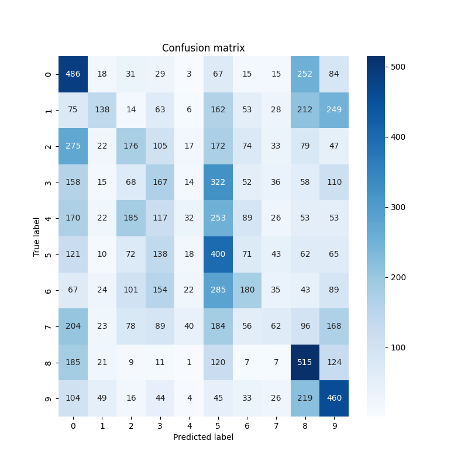

# CIFAR-10 MLP from scratch

A three-layer fully connected neural network for CIFAR-10, written in NumPy.
Forward pass, backpropagation, softmax cross-entropy and mini-batch SGD are all
implemented by hand — no autograd, and no deep learning framework anywhere in
the dependency list. A small Flask service serves the trained weights.



## What it does

- Implements a 3072 → 256 → 128 → 10 network with relu hidden layers and a
  softmax output, with gradients derived and coded directly
- Trains with mini-batch SGD and early stopping on a held-out validation split
- Reports accuracy, a per-class precision/recall/F1 table and a confusion matrix
- Serves predictions over HTTP from saved weights
- Downloads and parses the CIFAR-10 archive with the standard library

## Quick start

```bash
pip install -r requirements.txt
python -m src.main          # downloads CIFAR-10 on first run, then trains
```

Serve the trained weights:

```bash
python -m api.app
python api/test_request.py  # posts one random image
```

```bash
pytest tests/
```

## How it works

`src/main.py` loads CIFAR-10, scales pixels to `[0, 1]` and flattens each
32×32×3 image into a 3072-vector. A validation split is carved out of the
training set, and training stops once validation loss has not improved for five
epochs. The test set is touched exactly once, after model selection is finished,
so the reported accuracy is not inflated by early stopping.

Weights are stored as a `.npz` archive of plain arrays rather than a pickle, so
loading them cannot execute code.

| Path | What it is |
|---|---|
| `src/neural_network.py` | the network: forward, backward, save/load |
| `src/helper_functions.py` | softmax, relu and cross-entropy primitives |
| `src/trainer.py` | mini-batch loop, validation split, early stopping |
| `src/evaluator.py` | accuracy, classification report, confusion matrix |
| `src/data_loader.py` | fetches and unpacks the CIFAR-10 archive |
| `api/app.py` | Flask service: `/health`, `/predict` |
| `tests/` | unit tests for the network, training and the API |

## Results

RESULTS_PLACEHOLDER

## License

MIT — see [LICENSE](LICENSE).
